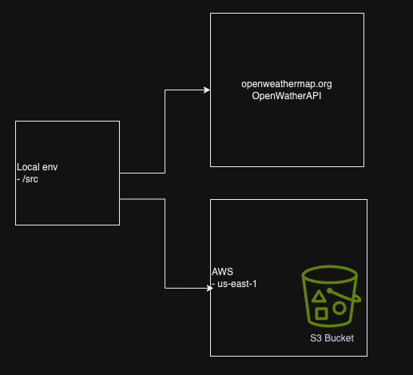
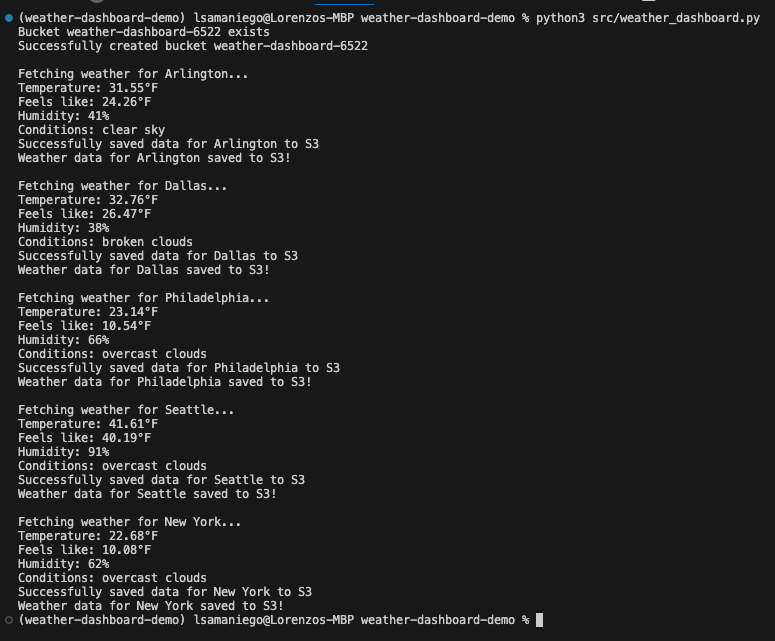

# Day One Exercise
This exercise is a part of the 30 Days DevOps Challenge. This is a great way to refresh one's skills and collab with the DevOps community.  

## Project Overview
The project is a weather data collection script that uses the following tech. 
- External API (OpenWeather API)
- AWS S3
- Python development
It is a local python script that creates and/or validates that a S3 bucket exist. It then pulls the current weather status from the OpenWeather API. Then it uploads the results in JSON format to S3. 



## Features
- Fetches real-time weather data for multiple cities
- Displays temperature (°F), humidity, and weather conditions
- Automatically stores weather data in AWS S3
- Supports multiple cities tracking
- Timestamps all data for historical tracking

## Technical Components
- **Language:** Python 3.x
- **Cloud Provider:** AWS
- **External API:** OpenWeather API
- **Dependencies:** 
  - boto3 (AWS SDK)
  - python-dotenv
  - requests

## Setup 
1. Clone repo
```
git clone git@github.com:ZoSam32/30DC-DayOne.git
```
2. Create Python virtual environment and activate
```
python3 -m venv . 
source bin/activate
```
3. Install dependencies
```
pip3 install -r requirements.txt
```
4. Configure environment variables (.env). **CAUTION**: Do **NOT** check your .env file into source control
```
OPENWEATHER_API_KEY=your_api_key
AWS_BUCKET_NAME=your_bucket_name
```
5. Configure your local AWS credentials. AWS reference [here](https://docs.aws.amazon.com/cli/latest/userguide/cli-configure-files.html#cli-configure-files-methods)
```
aws configure
```
6. Run application
```
python3 src/weather_dashboard.py
```
Sample output

